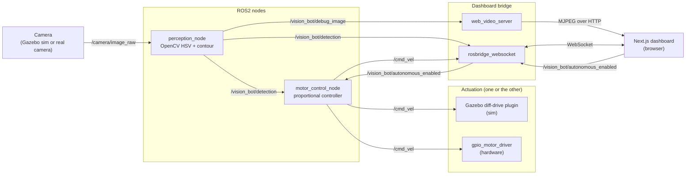

# vision_bot -- Vision-Guided Rover

Read **`PROJECT_PLAN.md`** first -- it has the full architecture rationale,
week-by-week roadmap, hardware parts list (optional), and resume framing.

This repo is a real, runnable project, not pseudocode:

```
ros2_ws/src/vision_bot/   ROS2 package: perception_node, motor_control_node,
                           gpio_motor_driver, Gazebo launch + world + URDF
docker/                    Dockerfile + compose file -- the actual dev
                           environment (ROS2 Humble + Gazebo Classic 11)
dashboard/                 Next.js live-feed + status dashboard
PROJECT_PLAN.md            Full plan: roadmap, architecture, parts list
```

## Architecture

Perception and control are independent ROS2 nodes that only ever talk to
each other over topics -- that separation is the whole point (see
`PROJECT_PLAN.md` section 1). Nothing about vision lives in the control
node; nothing about motors lives in the perception node. The dashboard is
a third, completely separate consumer of the same topics via rosbridge --
it can't see anything the ROS2 graph doesn't already expose.



## Quickstart (simulation)

Windows has no good native ROS2 install path, so development happens inside
a Docker container. You'll want two terminals open once it's running: one
for the sim itself, one for driving it / inspecting topics.

**One-time setup (Windows only, for the Gazebo GUI window):**

```powershell
winget install marha.VcXsrv
Start-Process "C:\Program Files\VcXsrv\vcxsrv.exe" -ArgumentList "-multiwindow","-clipboard","-wgl","-ac"
```

`-ac` disables X11 access control so the container can connect to it. If a
Windows Firewall prompt appears the first time, click Allow. VcXsrv needs to
be running (check your system tray) before you launch the sim; it doesn't
survive a reboot on its own, so re-run the `Start-Process` line if it's gone.

**Terminal 1 -- build and launch:**

```powershell
cd docker
docker compose run --rm ros
```

This drops you into the container's bash shell (`root@<id>:/workspace/ros2_ws#`).
From there:

```bash
colcon build --symlink-install
source install/setup.bash
ros2 launch vision_bot sim_launch.py
```

A Gazebo window should appear (rendered via VcXsrv) with the rover and a red
target box. Pass `gui:=false` to run headless instead (e.g. in CI).

**Terminal 2 -- drive it manually / inspect topics:**

```powershell
cd docker
docker compose exec ros bash
```

```bash
source /opt/ros/humble/setup.bash
ros2 topic list
ros2 run teleop_twist_keyboard teleop_twist_keyboard
```

Or check the perception pipeline directly:

```bash
ros2 topic echo /vision_bot/detection
ros2 run rqt_image_view rqt_image_view   # view /vision_bot/debug_image
```

`motor_control_node` and `teleop_twist_keyboard` both publish to `/cmd_vel`
with no arbitration, so manual driving fights the autonomous loop whenever a
target is in view. Free up `/cmd_vel` for manual control with:

```bash
ros2 topic pub --once /vision_bot/autonomous_enabled std_msgs/msg/Bool "{data: false}"
```

(`{data: true}` hands control back.)

## Quickstart (dashboard)

**Terminal 3 -- rosbridge + video stream** (needs the sim already running from
Terminal 1; run inside the container, e.g. via `docker compose exec ros bash`):

```bash
source /opt/ros/humble/setup.bash
source /workspace/ros2_ws/install/setup.bash
ros2 launch vision_bot bridge_launch.py
```

This starts `rosbridge_websocket` (topics over WebSocket, for `roslibjs`) and
`web_video_server` (MJPEG stream over HTTP). They're published to the host as
9091 and 8081 respectively, not their usual 9090/8080 -- see the comment in
`docker/docker-compose.yml` for why.

**On the Windows host -- the dashboard itself:**

```powershell
cd dashboard
npm install
cp .env.local.example .env.local
npm run dev
```

Open http://localhost:3000 -- you should see the live camera feed and status
panel (connection state, detection offset, `/cmd_vel`) updating in real time.

## Status

- ROS2 package builds clean (`colcon build`) inside the Docker dev environment.
- Sim launches end-to-end: Gazebo spawns the rover, `perception_node` and
  `motor_control_node` come up as separate nodes, and `/camera/image_raw`,
  `/cmd_vel`, `/vision_bot/detection` are all live and correctly wired.
- Manually verified drivable via `teleop_twist_keyboard` -- `/cmd_vel`
  actually moves the rover in Gazebo.
- Perception confirmed working: the default HSV threshold reliably detects
  the red target box, with correct offset/area values.
- Control loop confirmed working: the rover drives toward the box and stops
  at a set distance (`stop_area_fraction`) instead of colliding with it.
- Dashboard confirmed working end-to-end: WebSocket connects to rosbridge
  and receives correctly-formatted messages, the MJPEG stream serves with
  the right content-type, and the Next.js app builds and renders correctly
  (validated with synthetic ROS data; not yet checked against the live sim
  in a real browser).
- Closed-loop behavior verified from multiple starting poses (repositioning
  the rover via `gz model` and checking the resulting detection/pose): an
  angled off-center approach, and starting turned 180 degrees away from the
  target. The second case caught a real bug -- `search_when_lost` was dead
  code because the "last detection" timestamp was refreshed on every camera
  frame instead of only on an actual detection, so the watchdog's search
  behavior could never trigger. Fixed and reverified; the rover now spins to
  reacquire a lost target and centers/approaches/stops correctly.
- Not yet done: a full lap/loop around a real track (current world has a
  single static target, not a loop) per the plan's definition of done.
